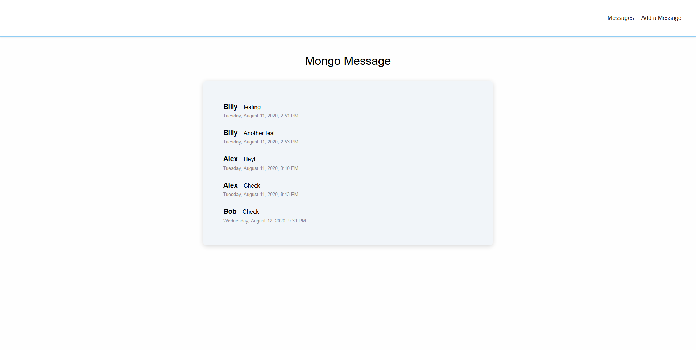

# Mongo Mini Message Board

[View Live Site](https://apcurran-mongo-message.herokuapp.com/)

## Express Backend:

* Utilizes Express JS framework for Node

* Uses EJS as a template engine for views

* Separate routes included for form and index views

* Post new messages to server

* Save messages on MongoDB database, with the native MongoDB driver

* Retrieve and display messages from database

* Deployment to Heroku